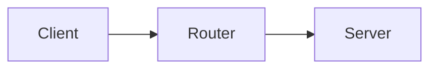
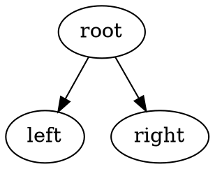

# IT Exam System

## Overview
A client-side exam engine for IT subjects using JSON-based data. Users select a subject → select chapters → take an exam → view results.

## Quick Start

### For Students (Using the Exam)
1. Open `index.html` in a browser
2. Select a subject
3. Choose chapters to study
4. Take the exam and get instant feedback

### For Admins (Managing Content)
1. Run `python builder/editor.py`
2. Manage sections and chapters
3. **Double-click any chapter to open the Advanced Editor**
4. Click **💾 Save All** in the top toolbar

---

## Main Features

### 📚 Exam Engine (Web App)
- **Subject Selection**: Browse available IT subjects
- **Chapter Selection**: Choose specific chapters for exam
- **Interactive Exams**: Answer questions with instant feedback
- **Results**: View score and explanations
- **Dark/Light Theme**: Toggle theme preference
- **Rich Code Blocks**: Line numbers, copy button, language badge
- **Math & Chemistry**: MathJax with `\(...\)` / `\[...\]` delimiters
- **Diagram Rendering**: Auto-renders Mermaid, Graphviz (DOT), and UML/Nomnoml blocks
- **Future Diagram Fallbacks**: Generic fenced blocks like `diagram` / `chart` route by subject defaults

### ⚙️ Admin Editor (Python Tool)
- **Section Management**: Add, import, delete sections
- **Section Icon Management**: Upload/edit icon per section with default path `data/<section>/icon.png`
- **Icon Preview**: Live preview in Add/Edit Section dialogs before saving
- **Internet Icon Support**: Search icons on web and use icon URLs directly
- **Emoji Icon Support**: Set section icons to emojis (for example ☕ 🚀 🌲 📚)
- **Icon Resize Option**: Auto-resize large icons during upload (recommended `128px` max)
- **Chapter Management**: Organize chapters per section
- **Batch Chapter Tools**: Multi-select chapters and run tools from **Tools** menu
- **Advanced Chapter Editor**: Double-click to edit questions
- **Diagram Authoring Buttons**: Quick insert for Mermaid (`MM`), UML (`UML`), DOT (`DOT`)
- **Diagram Validation Tool**: Advanced Editor Tools → Validate Diagram Blocks

### ✨ Advanced Chapter Editor
**Access**: Double-click any chapter in the editor

**Features:**
- ✏️ Edit question text, ID, number
- 🖼️ Add/remove images (auto-saved to `data/<section>/images/`)
- ➕ Add/edit/delete answer choices
- 📝 Write explanations
- 💾 Save changes directly to chapter files
- 🗑️ Delete chapters/questions with optional image cleanup

---

## File Structure

```
index.html                             # Exam web app
js/
  ├── exam-engine.js                   # Exam logic
  ├── exam-config.js                   # Subject config (auto-generated)
  └── content-renderer.js             # Markdown, Math & Code renderer
css/
  └── exam-styles.css                  # Styling
data/
  └── <subject>/
      ├── chapter1.json               # Questions & answers
      ├── chapters.json               # Chapter list
      ├── icon.png                    # Section icon (default location)
      └── images/                     # Question images (auto-created)
builder/
  └── editor.py                        # Admin manager tool
```

---

## How to Use

### Starting the Editor
```bash
python builder/editor.py
```

### Basic Workflow

1. **Select a Section** (left panel)
2. **View Chapters** (right panel)
3. **Batch Tools**: Multi-select chapters (Ctrl/Shift) → **Tools** menu (fix numbering/input typing, de-duplicate, delete)
4. **Simple Edit**: Select chapter → Edit name/ID/questions count → Click "✓ Update Chapter"
5. **Advanced Edit**: **Double-click chapter** → Opens Advanced Editor
6. **Save**: Click **💾 Save All**

### Advanced Chapter Editor
When you double-click a chapter:
- **Left panel**: List all questions
- **Right panel**: Edit selected question

**Quick actions:**
- ➕ Add Question / 🗑️ Delete Question
- ✏️ Edit choices / Browse images
- 💾 Save Changes (saves to chapter JSON)

---

## JSON Format

### Chapter File Structure
```json
{
  "title": "Chapter Title",
  "questions": [
    {
      "id": "1.1",
      "number": "1.1",
      "text": "Question text",
      "image": "data/section/images/file.png",
      "choices": [
        {"value": "A", "label": "A", "text": "Choice A"},
        {"value": "B", "label": "B", "text": "Choice B"}
      ],
      "inputType": "radio",
      "correctAnswer": "A",
      "explanation": "Why A is correct"
    }
  ]
}
```

---

## Content Authoring Guide

Question text, choices, and explanations support **Markdown**, **LaTeX math**, **chemistry formulas**, and **syntax-highlighted code blocks**. Use the standard syntax below when writing question content.

### Syntax Reference

| Syntax | Use Case | Example |
|--------|----------|---------|
| `\(...\)` | Inline math/physics | `\(F = ma\)`, `\(E = mc^2\)` |
| `\[...\]` | Display math (centered) | `\[\int_0^\infty e^{-x} dx = 1\]` |
| `\ce{...}` | Chemistry (mhchem) | `\ce{H2O}`, `\ce{2H2 + O2 -> 2H2O}` |
| `` `code` `` | Inline code | `` `System.out.println()` `` |
| ```` ```java ```` | Code block (with line numbers & copy button) | Fenced code with language tag |
| ```` ```mermaid ```` | Mermaid diagrams (network/ER/flow/UML-like) | `flowchart LR`, `erDiagram`, `sequenceDiagram` |
| ```` ```dot ```` | Graphviz diagrams | `digraph G { A -> B; }` |
| ```` ```uml ```` | Nomnoml UML class diagrams | `[User]-[Order]` |
| `**bold**` | Bold text | `**important**` |
| `*italic*` | Italic text | `*emphasis*` |
| `- item` | Bullet list | `- First item` |

### Supported Code Languages
`java`, `python`, `c`, `cpp`, `csharp`, `sql`, `javascript`, `html`

### Example Question JSON
```json
{
  "id": "phys.1",
  "text": "If \\(F = ma\\) and \\(m = 5\\text{kg}\\), \\(a = 3\\text{m/s}^2\\), what is \\(F\\)?",
  "choices": [
    {"value": "A", "label": "A", "text": "\\(15\\text{N}\\)"},
    {"value": "B", "label": "B", "text": "\\(8\\text{N}\\)"}
  ],
  "inputType": "radio",
  "correctAnswer": "A",
  "explanation": "Using **Newton's second law**: \\[F = ma = 5 \\times 3 = 15\\text{N}\\]"
}
```

### Diagram Example Snippets

```text

```

```text

```

```text
```uml
[User|+id;+name|+login()]
[Order|+id;+total|+checkout()]
[User]1-*[Order]
```
```


---

## Tips & Tricks

✅ **DO:**
- Save frequently with **💾 Save All**
- Use the Advanced Editor for full control
- Keep image files in the auto-created `images/` folder
- Use `\(...\)` for inline math, `\[...\]` for display math (not `$`)
- Use simple choice values (A, B, C, D)

❌ **DON'T:**
- Forget to save changes
- Move image files manually
- Edit JSON files directly (use the editor)
- Leave questions without explanations

---

## Troubleshooting

| Issue | Solution |
|-------|----------|
| Advanced editor won't open | Make sure chapter file exists in section folder |
| Images not showing | Images must be in `data/<section>/images/` |
| Changes lost | Always click **💾 Save All** |
| Button errors | Use latest Python 3.6+ with Tkinter |
| Diagram block not rendered | Ensure fenced language is `mermaid`, `dot`, or `uml` (or run Tools → Validate Diagram Blocks) |

---

## Diagram Testing

### 1) Python unit tests (engine resolution + validation)
```bash
python -m unittest tests/test_diagram_support.py
```

### 2) Browser smoke test (real rendering)
Open this file in a browser:

`tests/diagram-render-smoke.html`

Expected result: **5/5 passed** for Network, Database, UML, Data Structure, and generic future diagram fallback.

---

## Project Structure

### Web App (Exam Engine)
- **index.html**: Main application interface
- **exam-engine.js**: All exam logic and UI rendering
- **exam-config.js**: Auto-generated subject/chapter config
- **content-renderer.js**: Markdown, MathJax & Prism.js rendering pipeline
- **exam-styles.css**: Responsive design with themes

### Data Management
- **data/<subject>/**: Subject folder with chapters
- **config/sections.json**: Registry of all subjects
- **builder/editor.py**: Admin tool for content management


